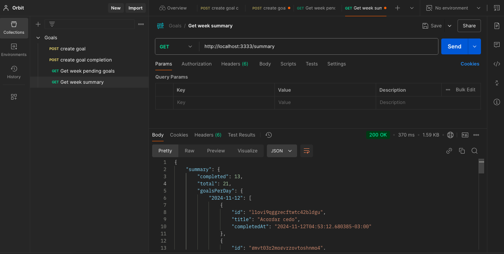

# Orbit Project

## Requisites

- Node.js
- Docker

## HTTP

### POST `/goals`

Create a new goal.

#### Request body

```json
{
    "title": "Jogar Bola",
    "desireWeeklyFrequency": 4
}
```

### POST `/completions`

Complete a goal.

#### Request body

```json
{
  "goalId": "o0ld5kqvzqro4erx0czbkl6o"
}
```

### GET `/pending-goals`

Get all objectives to complete.

#### Response body

```json
{
    "pendingGoals": [
        {
            "id": "ga90qd9nartstev5bizuvszc",
            "title": "Me exercitar",
            "desireWeeklyFrequency": 5,
            "completionCount": 5
        },
        {
            "id": "ntlkk5arkki261lknidosael",
            "title": "Nadar",
            "desireWeeklyFrequency": 2,
            "completionCount": 2
        }
    ]
}
```

### GET `/summary`

Get a summary of all the objectives.

#### Response body

```json
{
  "summary": {
    "completed": 13,
    "total": 21,
    "goalsPerDay": {
      "2024-11-10": [
          {
              "id": "f2k1x0xr5a64ejzyh38w5xwo",
              "title": "Me exercitar",
              "completedAt": "2024-11-10T12:43:26.627-03:00"
          },
          {
              "id": "bxyhxqqu3mffonsw6p1srztl",
              "title": "Me exercitar",
              "completedAt": "2024-11-10T04:48:28.338-03:00"
          },
          {
              "id": "b5lsyyx97xdprylj1w53vkjx",
              "title": "Me exercitar",
              "completedAt": "2024-11-10T04:43:42.771-03:00"
          },
          {
              "id": "hbhbwg9j026zlt2jvb8qganb",
              "title": "Nadar",
              "completedAt": "2024-11-10T00:00:00-03:00"
          }
      ]
    }
  }
}
```


## Install dependencies

```bash
npm ci
```

## .env file

```bash
cp .env.example .env
```

## Drizzle kit migrate

```bash
 npx drizzle-kit migrate
```

## Drizzle kit studio

```bash
npx drizzle-kit studio
```

## Run Docker Compose

```bash
docker compose up -d
```

## Run app

```bash
npm run dev
```

## Api client

- Test it! ([Postman](https://www.postman.com/)).

## Licença

Este projeto está licenciado sob a licença MIT.
