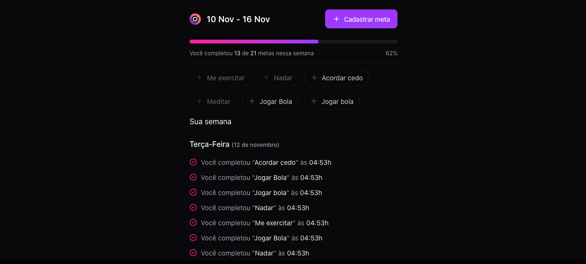

<h1 align="center">
  Project Orbit
</h1>


**Demonstração:**

<p align="center">
  
  
</p>


**Instalação e Execução:**

1.  Clone o repositório:

Bash

```
git clone https://github.com/Gui-dev/project-orbit.git

```

2.  Instale as dependências

Bash

```
npm ci

```

3.  Execute a aplicação:

Bash

```
npm run dev
```

4.  Acesse a aplicação em http://localhost:5173 no seu navegador.

**Contribuição:**

Agradecemos a sua contribuição para este projeto! Você pode contribuir submetendo issues e pull requests no repositório GitHub.

**Licença:**

Este projeto está licenciado sob a licença MIT.
